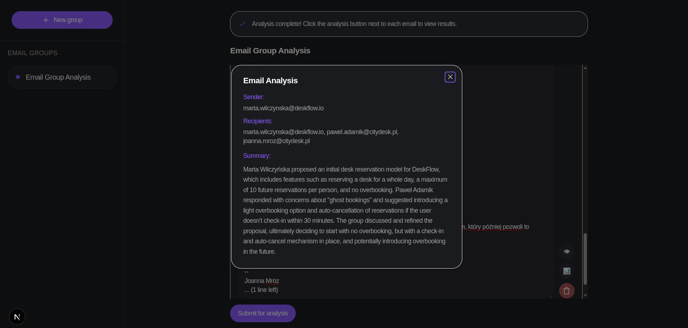

# 🚀🚀 InboxLens 🚀🚀

**Next-Gen Email Analysis (LLM-Powered) ✨**  

InboxLens helps you extract insights from emails with AI-powered intelligence, RAG tracking, and timeline visibility.  

## Features

- **📄 Smart Metadata Extraction** – Capture sender, recipients, subject, and topics effortlessly  
- **🤖 AI-Powered Insights** – Summarize conversations, classify emails, and auto-tag key information  
- **🚀 RAG Status at a Glance** – Instantly track priorities and urgency  
- **⏳ Timeline & Backlog Intelligence** – Monitor conversation changes, pending actions, and follow-ups  



## Setup

### Database & Backend
Launch the database and backend:  
```bash
docker compose up -d
```

Run migrations once the DB is ready:

```bash
alembic upgrade head
```

### Frontend

Build and start the frontend:

```bash
cd frontend
npm run build
npm run start
``` 

## License
